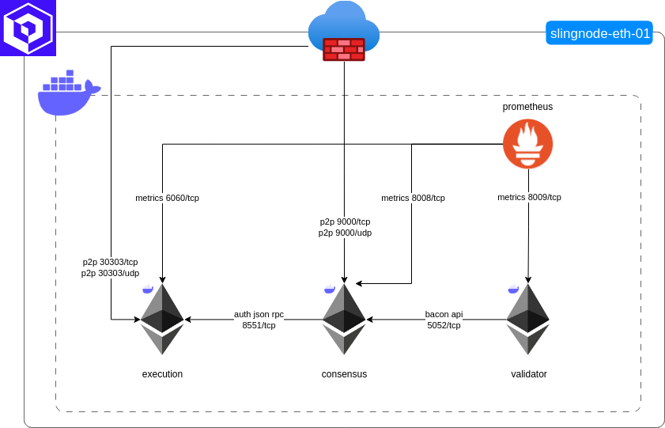
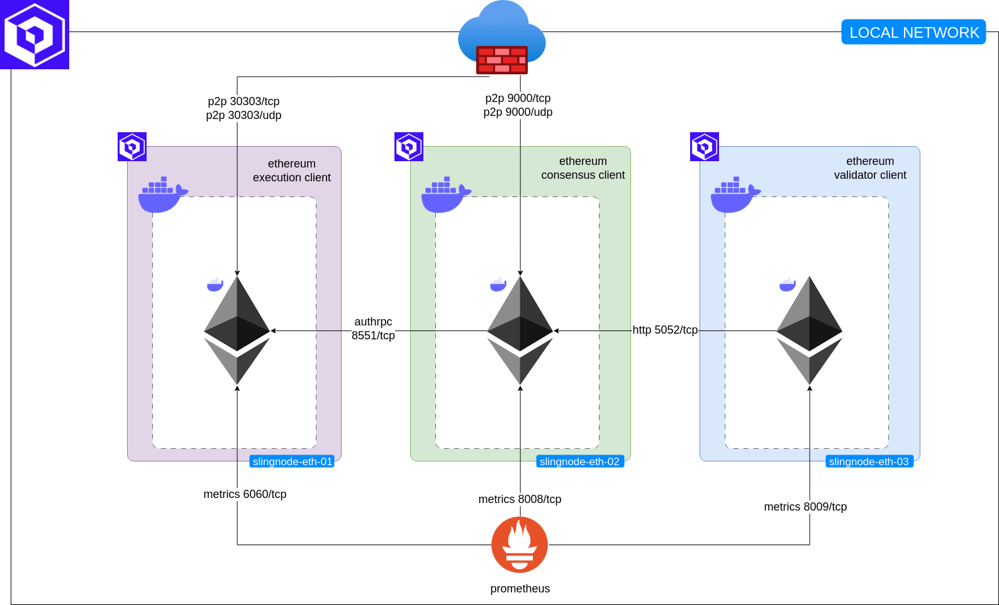

# Overview

slingnode.ethereum is an Ansible role that facilitates deployment of Ethereum clients. Its objective is to enable a consistent way of deploying and upgrading the chosen client mix. The role can be used to deploy:

* a single node running execution, consensus and validator layers&#x20;
* hundreds of nodes running all three layers&#x20;
* a distributed set up with each layer running on a separate server&#x20;
* change client mix (as seamlessly as this can be done)
* upgrade clients

The project uses Docker Compose to deploy and manage the lifecycle of the clients. We believe that that the software developers know best how to build and package their software. Therefore slingnode.ethereum uses unmodified stable Docker images published and maintained by the original developers (the docker image is specified as variable and can be modified for each client if a role user wants to use their own image, this will work as long as the entrypoint is the same).&#x20;

### Target audience

slingnode.ethereum can be used by anyone from a solo-staker running a single node to a DevOps Team deploying and managing hundreds of servers. Check out example Playbooks to see how this can be implemented using group\_vars.

## Deployment types

slingnode.ethereum role supports two types of deployment, a single server deployment where all client layers run on a single server and a distributed deployment where each layer runs on a separate server.

### Single server deployment

In a single server deployment (default type) all client layers run on a single server and communicate over [Docker Network](architecture/#docker-network) as depicted in the diagram below.

<figure><figcaption>
Single server deployment
</figcaption></figure>

### Distributed deployment

In a distributed deployment the clients run on separate servers and communicate over the network (LAN) as depicted in the diagram below.&#x20;

<figure><figcaption>
Distributed deployment
</figcaption></figure>

## Repositories

The role is available from Ansible Galaxy: [https://galaxy.ansible.com/slingnode/ethereum](https://galaxy.ansible.com/slingnode/ethereum)

The source code is on Github: [https://github.com/SlingNode/slingnode-ansible-ethereum](https://github.com/SlingNode/slingnode-ansible-ethereum)

## Project's principles

* use unmodified official docker images
* require only a running Docker daemon and the Compose plugin
* provide secure defaults
* keep it simple
* DRY

## Contact

If you have any questions join our [Discord server ](https://discord.gg/EPg7yfhmUU)or log a GitHub issue.&#x20;

## Acknowledgments&#x20;

Throughout the development we have

* referred to the amazing Eth-Docker project - [https://github.com/eth-educators/eth-docker](https://github.com/eth-educators/eth-docker)
* used Discord to seek help and explanations from various Ethereum projects

We'd like to thank the Eth-Docker maintainers as well as the individuals that have helped us in Discord.&#x20;
