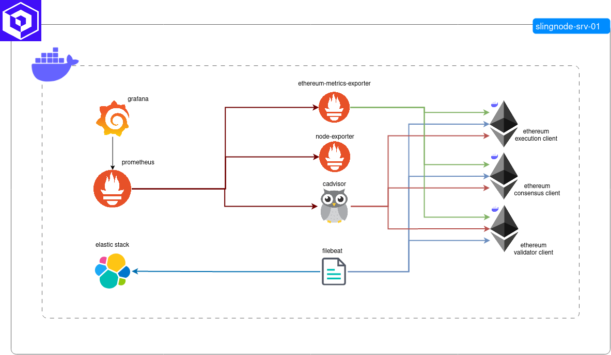
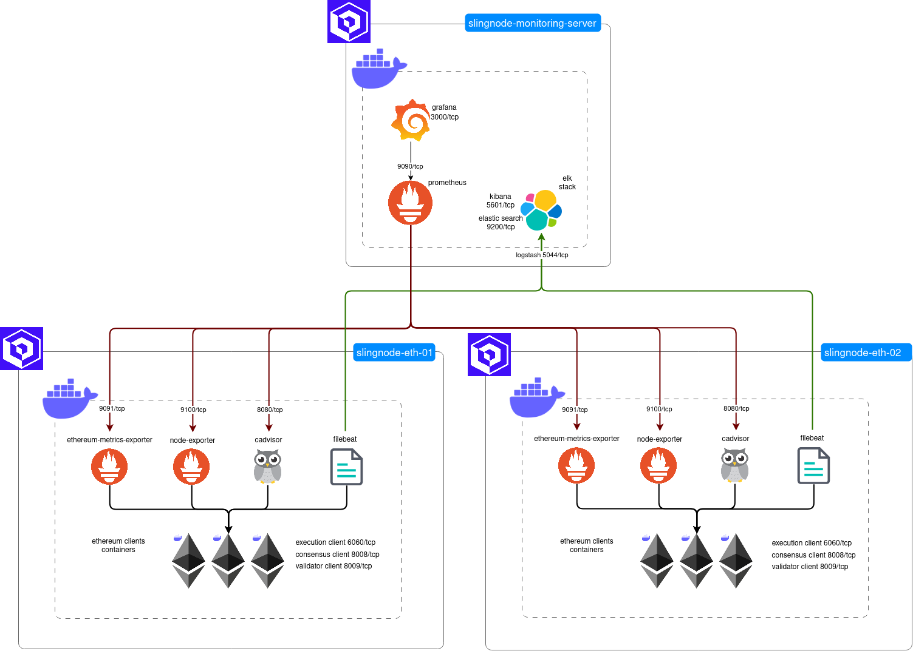

# Overview

slingnode.ethereum\_observability is an Ansible role used to deploy a full observability stack that seamlessly integrates with Ethereum nodes deployed by [slingnode.ethereum](https://docs.slingnode.com/slingnode.ethereum/) role. Both roles use the same naming for common variables. This means you can define them once in your Playbook, group\_vars or host\_vars and deploy a full Ethereum node along with the observability stack.&#x20;

Out of the box you get a fully functional stack with:

* ethereum client metrics
* node metrics
* container metrics
* parsed and aggregated client logs&#x20;
* dashboarding solution

The stack is comprised of:&#x20;

* ELK
* Filebeat
* Grafana
* Prometheus
  * Node-Exporter
  * Ethereum-Metrics-Exporter
  * Container Advisor

## Deployment types

SlingNode Observability Stack (SOS) can be deployed on a single server along with Ethereum clients or it can be used in a distributed deployment. The following sections describe both options.&#x20;

### Single server deployment

In a single server deployment (default type), all components ([monitoring server](architecture.md#monitoring-server) and [monitoring agents](architecture.md#monitoring-agents)) are deployed to the same server as the Ethereum clients. In this deployment type, the services communicate over Docker Network as depicted in the diagram below.&#x20;

<figure><figcaption>
Single server deployment
</figcaption></figure>

### Distributed deployment

In a distributed deployment, the [monitoring server](architecture.md#monitoring-server) (Prometheus, ELK, Grafana) is deployed to a dedicated node and configured to monitor Ethereum Clients running on remote servers. The monitoring agents (Filebeat, node-exporter, ethereum-metrics-exporter,  cadvisor) are deployed to the servers where the Ethereum clients are running. The monitoring server and agents communicate over the network as depicted in the diagram below.

<figure><figcaption>
Distributed deployment
</figcaption></figure>

## Customization

The role comes with a configuration for Prometheus, EL and Filebeat that will work out of the box for single server and distributed deployments. However the configuration is fully customizable to let you control the how those services work. The configuration files are templated out and specified by variables. Please refer to configuration section for details:

* [Prometheus configuration](components/prometheus/#configuration)
* [Logstash configuration](components/elk/#configuration)
* [Filebeat configuration](filebeat-configuration.md#configuration)

## Scalability

Scalability of an observability stacks is a big topic. There are a lot of variables  that factor into it. Amongst others:

* Scrape interval
* Logging level
* Retention period
* Number of monitored hosts
* Types of applications&#x20;
* Types of OSes
* Data query patterns (frequency, bucket sizes)
* Availability requirements

SlingNode Observability Stack is meant to be used for monitoring "small deployments". What's small? We have successfully monitored 10 servers running full Ethereum stack (execution, consensus, validator) with scrape interval of 5s, info logging level and 30 days data retention.&#x20;

Having said that we don't have any precise benchmarks.&#x20;

As outlined above this stack will work perfectly fine for a "small deployment". However if you need to scale your observability infrastructure and make it "production grade" you will need something more elaborate. SlingNode Team has extensive experience building and maintaining large scale observability solutions and is ready to help out. Contact us at  "contact - at - slingnode.com".&#x20;
