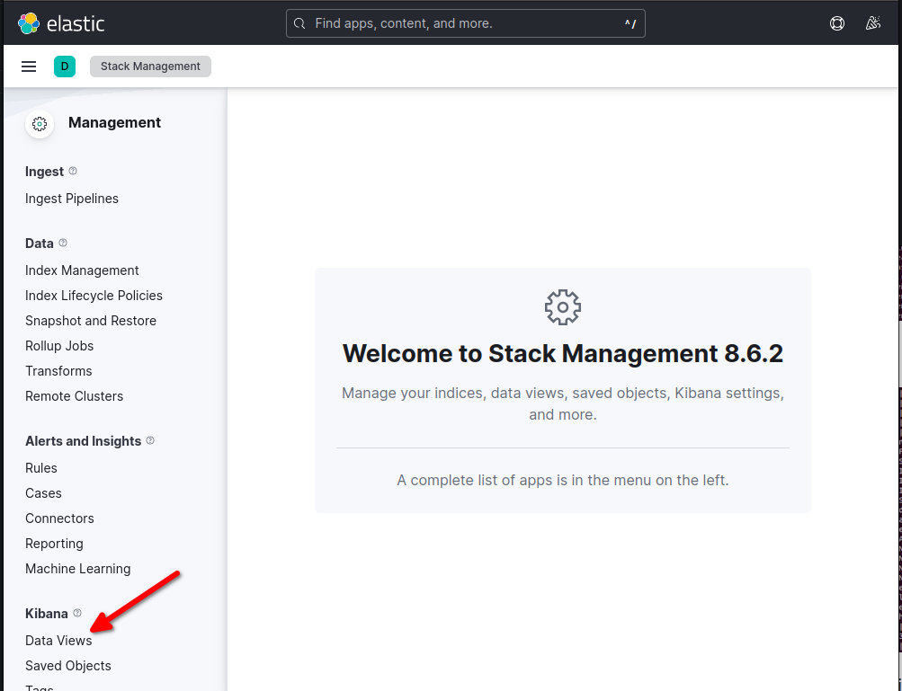

# Creating Kibana Data View

Parsed logs will not be visible in Kibana until Data View is created. Data View tells Kibana which ElasticSearch index to use.&#x20;

Follow stepd below to create the Data View.

1. Navigate to "Stack Management"

<figure><figcaption></figcaption></figure>

2. &#x20;Click "Data Views"

<figure><figcaption></figcaption></figure>

3. Click "Create data view"&#x20;

Note: The screen should say "You have data in ElasticSearch". If it doesn't it means the logs are not forwarded or ingested properly.&#x20;

<figure><figcaption></figcaption></figure>

4. Enter "docker" under name and "docker-" under Index pattern and click "Sava data view to Kibana"&#x20;

<figure><figcaption></figcaption></figure>

5. You should see the logs under Analytics>Discover
